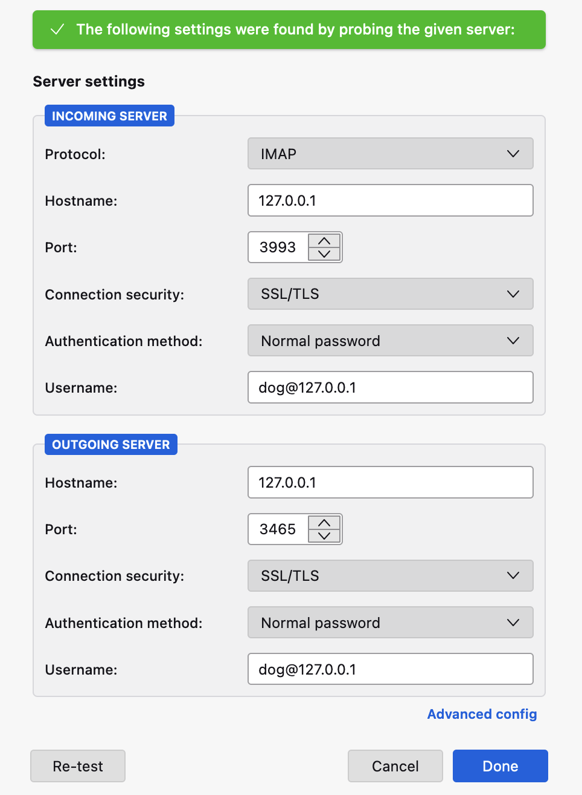
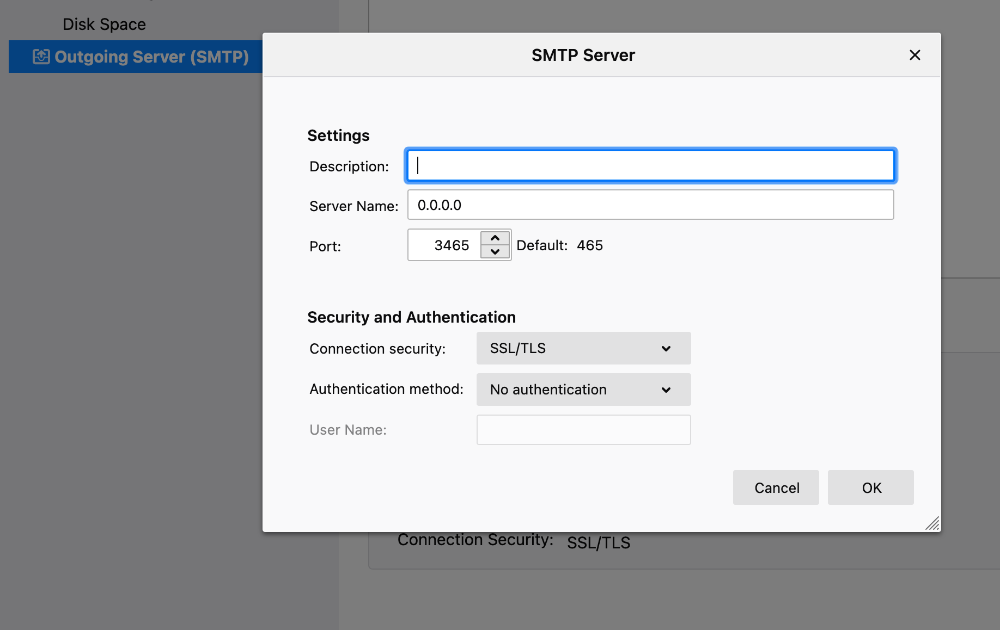
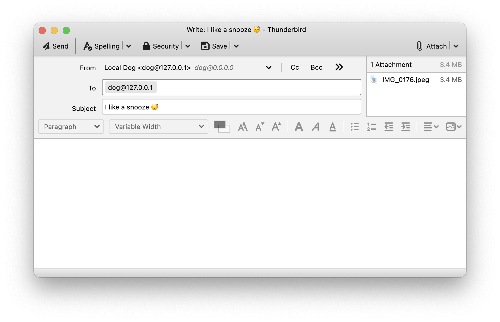

# Testing via Greenmail

Run a local SMTP/IMAP server:

```
$ docker run -t -i -e GREENMAIL_OPTS='-Dgreenmail.setup.test.all -Dgreenmail.hostname=0.0.0.0 -Dgreenmail.auth.disabled -Dgreenmail.verbose' -p 3025:3025 -p 3110:3110 -p 3143:3143 -p 3465:3465 -p 3993:3993 -p 3995:3995 greenmail/standalone:1.5.9
```

Set up something like Thunderbird to send mail to local SMTP and collect from local IMAP.

Run dogpost with:

```
AWS_ACCESS_KEY_ID=zzz AWS_SECRET_ACCESS_KEY=yyy cargo run -- --imap-allow-untrusted --imap-password 1234 --imap-hostname 127.0.0.1 --imap-port 3993 --imap-user dog@127.0.0.1 --posts-dir ./tmp --media-dir ./tmp --s3-bucket xxx
```


## Thunderbird set up








